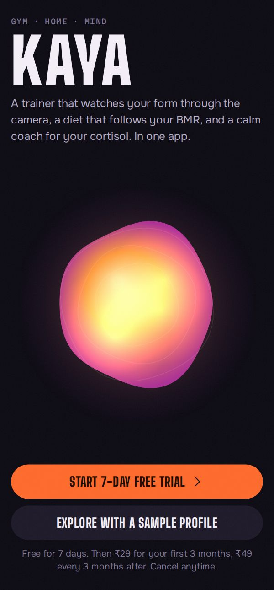
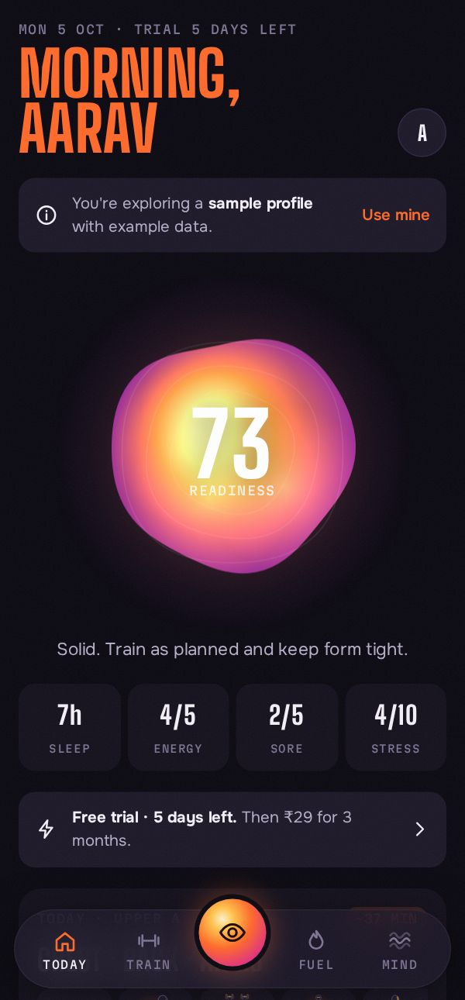
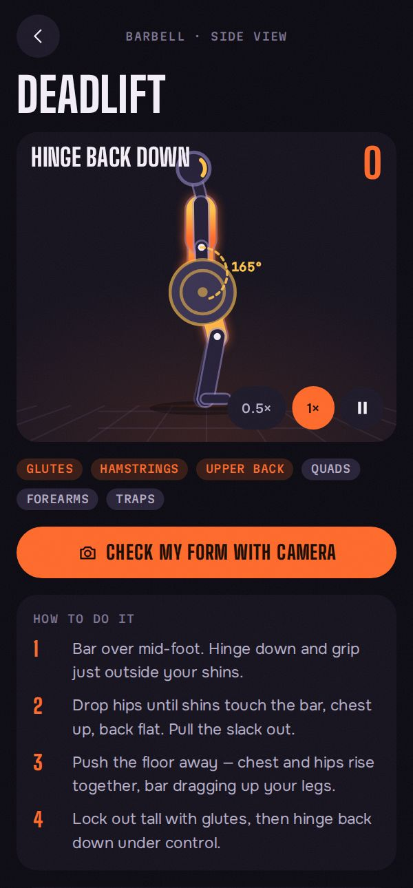
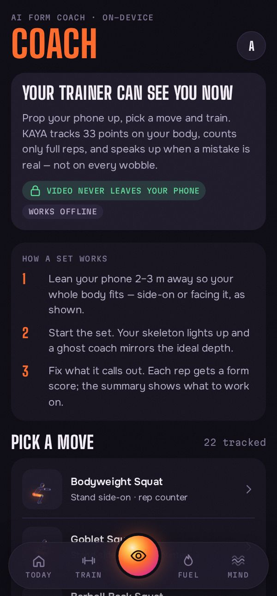
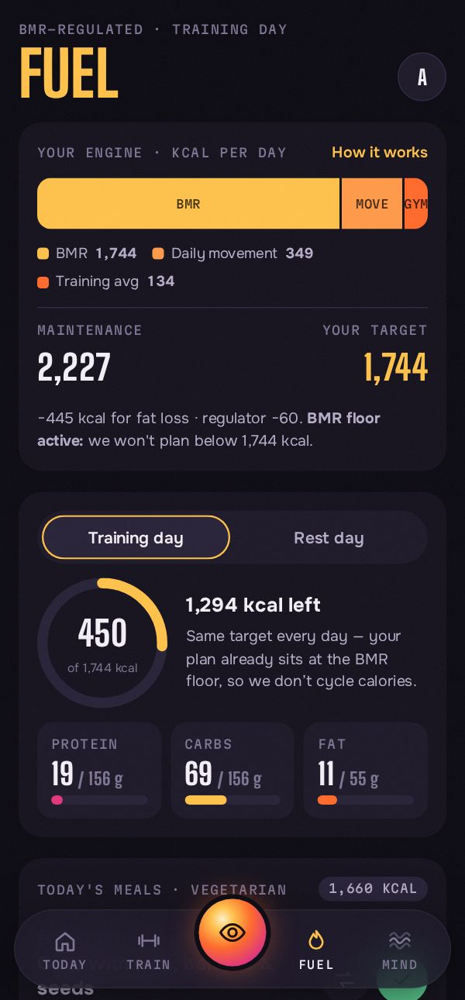
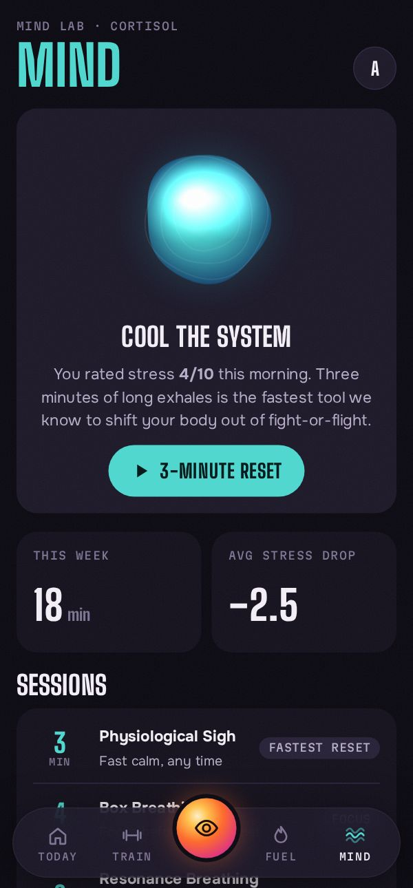
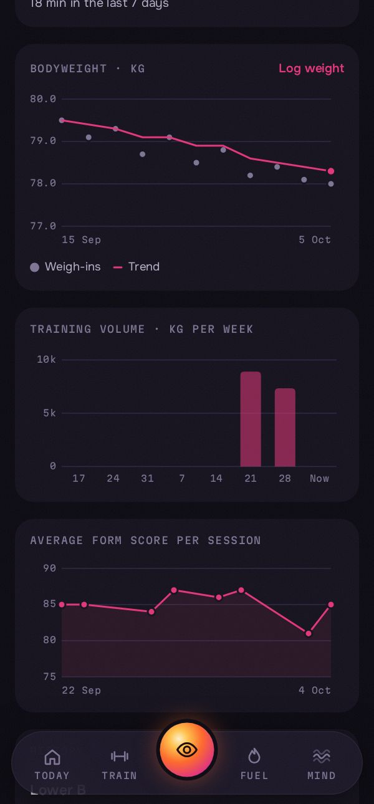
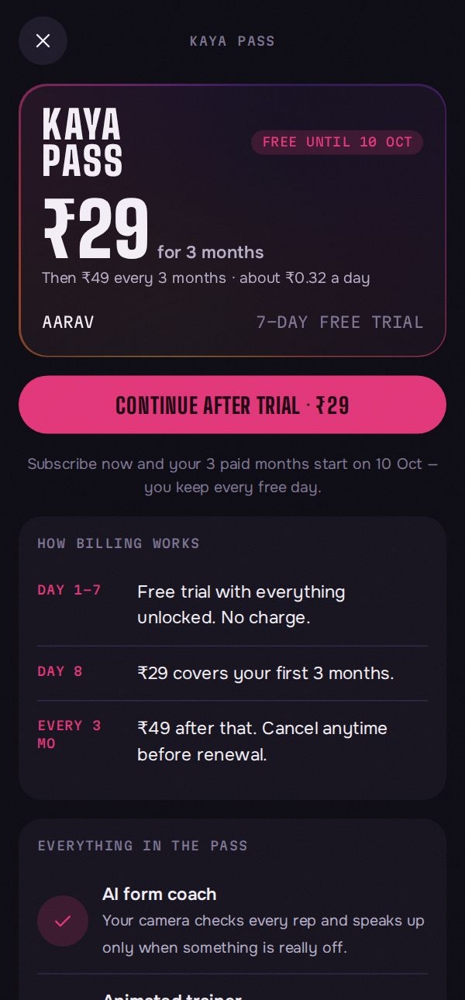

# KAYA — the gym trainer that lives in your phone

**A Relies Production app.** © 2026 Relies Production. All rights reserved — see [LICENSE](LICENSE).

KAYA replaces the personal trainer with three things that work together:

- **An animated coach** that demonstrates every move, with tempo, bar path and live joint angles.
- **A camera that watches your form.** On-device AI tracks 33 body points, counts only full reps and speaks up when a mistake is *real* — not on every wobble.
- **A body-and-mind plan**: an adaptive gym/home program, a BMR-regulated Indian diet that re-tunes itself every week, and a Mind lab of breathwork that brings cortisol down.

**KAYA Pass:** 7-day free trial → **₹29 for the first 3 months** → **₹49 every 3 months**. Cancel anytime.

<p>




</p>
<p>




</p>

## Install the Android app

1. Download **[`release/KAYA-1.1.0.apk`](release/KAYA-1.1.0.apk)** on your phone.
2. Open it and allow *Install unknown apps* for your browser or file manager when Android asks.
3. Open KAYA → **Start 7-day free trial** (or **Explore with a sample profile** to see it filled with example data).

Requires Android 7.0+ with an up-to-date *Android System WebView* (Play Store). Everything — including the AI pose model — is inside the APK, so the coach works offline in the gym.

## What's inside

| Area | What it does |
|---|---|
| **Today** | A daily **streak** (one missed day a week is bridged by a streak freeze), **three daily quests** (check in, train or breathe, log meals), XP **levels** from Spark to Supernova, and a "thermal core" orb showing readiness from a 20-second check-in. Low readiness automatically drops a set. The **training load map** shows weekly sets per muscle against your target plus recovery since you last trained it — it shows effort, not body temperature. |
| **Train** | A weekly program built from your goal, level, days (2–6), place (gym / home + dumbbells / no equipment), session length and injuries (knees, lower back, shoulders get safer swaps). Guided player with set logging, rest timer, and automatic **progressive overload**: hit the top of the rep range with form score 75+ and the weight goes up next time. |
| **Animated coach** | 23 exercises animated by a kinematic "holo-mannequin" (forward kinematics + 2-bone IK, so limbs never stretch). Working muscles glow, the bar path is traced and the key joint angle is measured live. 0.5× slow-motion. |
| **AI form coach** | MediaPipe Pose Landmarker (Precise "full" model, automatic fallback to Fast on slower phones) runs on the phone. Joint angles come from **3D world landmarks**, so they stay correct when you're not perfectly side-on; a One Euro filter removes jitter without lag; the tracked side is locked so it doesn't flicker. Before counting, KAYA checks framing (too far, cut off, wrong angle) and light, then runs a 3-2-1 countdown that **calibrates your start position**. Each rep gets depth %, down/up tempo and a form score; the live overlay shows the key joint angle against its target. Faults are spoken only when real (persist ~0.5 s or repeat in 2 of 3 reps). Auto-pauses when you leave the frame. Works with the live camera or a recorded video. Video never leaves the device. |
| **Fuel** | BMR (Mifflin-St Jeor, or Katch-McArdle with body-fat %) + daily movement + training cost = maintenance. Goal adjustment on top, but **never below your BMR**. Training-day/rest-day calories, macros, water, and meal plans (veg, eggetarian, non-veg, vegan) with swaps from **14 food regions**: India (all, North, South, East, West), France, Italy, UK, USA, Middle East, Japan, China, Mexico and Brazil — 194 dishes, same calorie and protein targets everywhere. The **metabolic regulator** reads your real weight trend each week and nudges calories by up to 150 kcal/day. |
| **Mind** | Physiological sigh, box breathing, resonance breathing, 4-7-8, post-workout down-shift and a 10-minute NSDR body scan, with an animated breathing orb, voice guide and tones. Stress before/after is tracked. A "Cortisol & your body" section explains the HPA rhythm, what chronic cortisol does to fat, muscle and sleep, and what the research actually shows (with citations). |
| **You** | Goals (weight, lifts, workouts/week, calm minutes), bodyweight trend, weekly training volume, form-score trend, history, voice/sound settings, backup/restore. |
| **Reminders** | Up to three Android notifications a day (morning check-in, training or recovery, close your day) at times you choose. They work when the app is closed, survive a restart, skip anything you've already done, and change wording with your streak and plan. |
| **Voice** | Every spoken line has an id. Drop recorded clips (e.g. from ElevenLabs) into `assets/voice/` and the coach uses your voice; anything not recorded falls back to the phone's voice. See [docs/voice](docs/voice/README.md). |
| **KAYA Pass** | 7-day trial, ₹29 intro quarter, ₹49 per quarter after. Subscribing during the trial never costs free days. |

## Project layout

```
index.html, css/, js/          the app (vanilla ES modules, no build step)
  js/engine/figure.js          animation engine (FK + IK, renderer)
  js/engine/exercises.js       exercise library: keyframes, coaching text, camera rules
  js/engine/formcheck.js       landmarks → joint metrics → reps, faults, scores
  js/engine/pose.js            MediaPipe loader, camera, skeleton overlay
  js/engine/routine.js         program builder, progression, readiness
  js/engine/nutrition.js       BMR, energy budget, macros, meal plans, regulator
  js/engine/breath.js          breathwork sessions + cortisol science
  js/engine/subscription.js    trial and billing rules
  js/views/*                   screens
vendor/mediapipe/              on-device pose model + WebAssembly (Apache-2.0)
android/                       native shell (WebView, camera permission, TTS, back button, UPI links)
android/build-apk.sh           Gradle-free APK build: aapt2 → javac → dx → zipalign → apksigner
server/server.mjs              optional backend: serves the web app + Razorpay subscriptions
tests/                         node:test suites (engines, form coach, billing, server)
```

## Develop

```bash
npm test                 # 28 tests: BMR, regulator, billing, programs, IK, rep counting, 3D angles, regions, streaks…
npm start                # http://localhost:8080 — the web version (camera needs https or localhost)
npm run build:apk        # builds release/KAYA-<version>.apk
```

`build:apk` needs `android-sdk-platform-23 aapt zipalign apksigner dalvik-exchange` (Ubuntu/Debian packages) or a normal Android SDK via `ANDROID_HOME`. The first build creates `android/kaya-release.keystore` (git-ignored). **Keep that keystore and `android/keystore.properties` safe** — Android only installs updates signed with the same key.

Every push runs `.github/workflows/android.yml`: tests, then a signed APK uploaded as a build artifact. To sign CI builds with your release key, add repository secrets `KAYA_KEYSTORE_BASE64` (`base64 -w0 android/kaya-release.keystore`) and `KAYA_KEYSTORE_PASSWORD`.

## Turning on real payments (Razorpay)

Payments run in **demo mode** until you connect Razorpay — the pass activates without charging, and the checkout says so.

1. In the Razorpay dashboard create a **plan**: ₹49, period `monthly`, interval `3`.
2. Create an **offer** for subscriptions giving ₹20 off the first payment (→ ₹29). Check the current offer rules in Razorpay's docs for your account.
3. Deploy `server/server.mjs` (any Node 18+ host) with `RAZORPAY_KEY_ID`, `RAZORPAY_KEY_SECRET`, `RAZORPAY_PLAN_ID`, `RAZORPAY_INTRO_OFFER_ID`, and optionally `RAZORPAY_WEBHOOK_SECRET`. The server schedules the first charge after the 7-day trial (`start_at`) and verifies every payment signature.
4. In `js/config.js` set `payments.mode = 'razorpay'` and `apiBase` to your server URL, then rebuild the APK.

UPI app links (GPay, PhonePe, Paytm) opened by Razorpay Checkout are handed to the installed apps by the Android shell.

## Recording the coach's voice

`docs/voice/KAYA-voice-script.md` lists all 109 lines with their file names (`count-01.mp3`, `fix-squat-partial.mp3`, …). Record them in ElevenLabs one by one, or generate them all at once with `tools/elevenlabs-generate.mjs`, put the files in `assets/voice/`, run `node tools/voice-manifest.mjs`, and rebuild. Details in [docs/voice/README.md](docs/voice/README.md).

## Copyright

KAYA, its design, animated coach, exercise library, content and voice are © 2026 Relies Production, all rights reserved ([LICENSE](LICENSE)). Bundled open-source components keep their own licences ([THIRD_PARTY_NOTICES.md](THIRD_PARTY_NOTICES.md)).

## Honest limits

- Form checks use one phone camera. 3D landmarks are estimated by the AI, not measured, so they catch what a camera can see reliably (depth, joint angles, hip line, symmetry, tempo). They can't judge spine rounding or grip, and they're a coach, not a physiotherapist.
- The load map shows training effort per muscle. A phone camera can't measure body heat or temperature.
- Food values are approximate for home-style cooking.
- Data lives on the phone (use **You → Back up**). Cloud sync and accounts need a backend; `server/` is the place to add them.
- KAYA gives general fitness guidance, not medical advice.
- The APK targets Android 14 (API 34) and is for direct installs. Google Play now requires newer target levels and an app bundle; that needs an Android Studio/Gradle build of the same `android/` sources.
