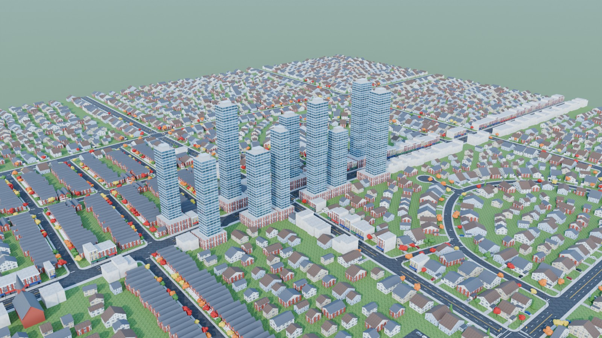
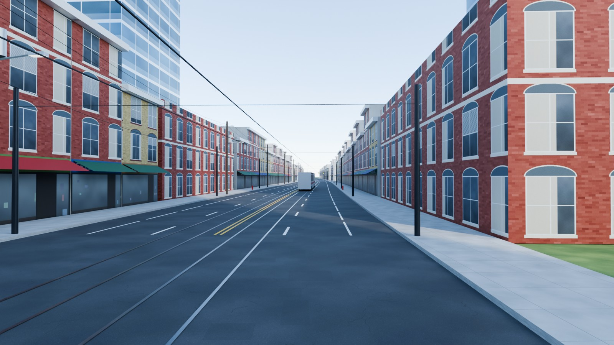
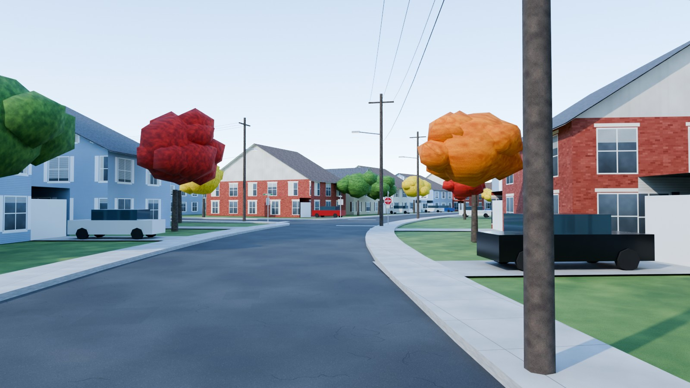
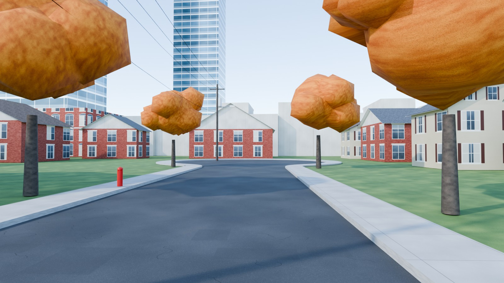
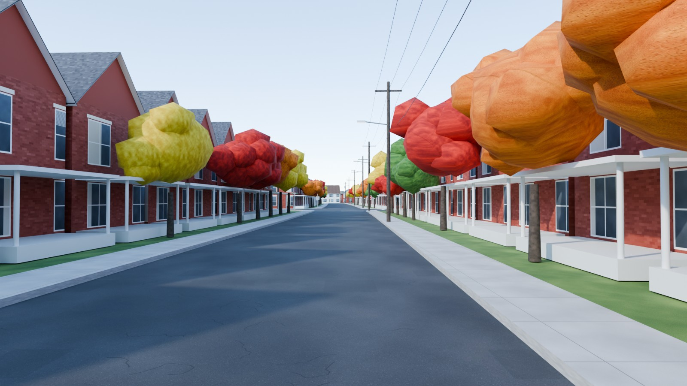
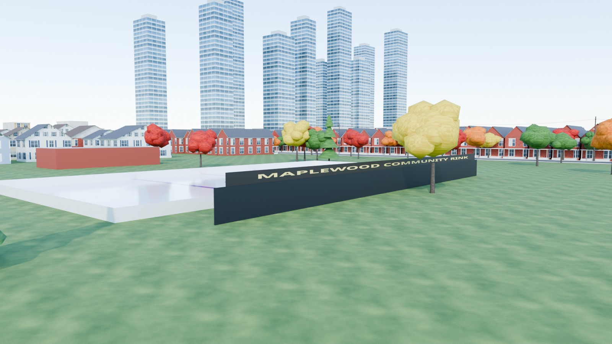
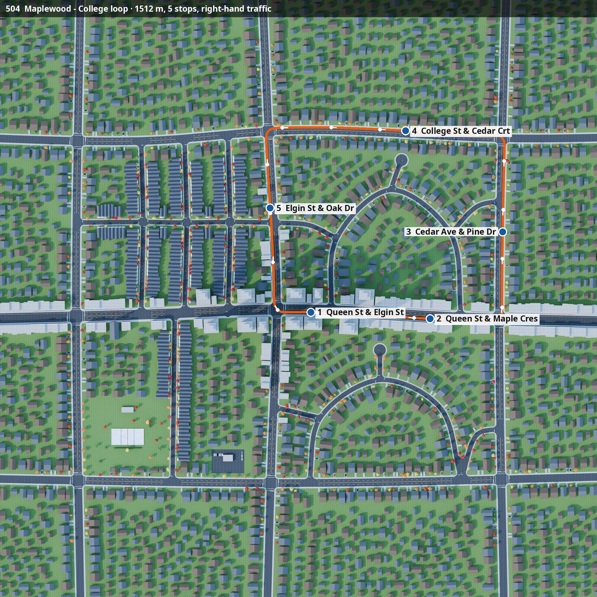

# Canada — Maplewood, Ontario (Toronto-inspired)

A Canadian neighbourhood in autumn, for **NammaBusSim**. Traffic drives on the **right**.

<p>






</p>



## What's in the map

| Real-life pattern | In the map |
|---|---|
| Toronto streetcar main street | *Queen St* has 2 streetcar tracks in the inner lanes, overhead wires on span poles, and parking lanes. It's lined with 2–3-storey Victorian brick storefronts with arched windows, cornices and striped awnings. A streetcar is running east. |
| Arterials | *Elgin*, *College*, *Front*, *Birch* and *Cedar* have yellow double centre lines and 3 m/6 m lane dashes. Signal junctions have mast-arm signals and two-line crosswalks. |
| Post-war suburbs | *Maple Cres* and *Birchwood Cres* are curving crescents that leave and rejoin their arterial. *Cedar Crt* and *Ash Crt* are cul-de-sacs with turning bulbs. Detached houses have siding, gable roofs, attached garages, driveways and lawns. |
| Old Toronto grid | Narrow streets lined with brick bay-and-gable semis that have front porches. |
| Street details | Wooden hydro poles with crossarms, transformer cans, cobra-head lights and wires. Minor-road approaches have STOP signs, with green street-name blades. Also red fire hydrants and maples in red, orange and yellow. |
| Landmarks | *Maplewood Community Rink* (outdoor ice in a park), a brick church with a steeple, a donut shop with a drive-thru queue, and glass condo towers near Queen & Elgin. |

**Route 504 — Maplewood–College loop** is 1.5 km with 5 stops. It runs:

1. East on Queen St, alongside the streetcar
2. North on Cedar Ave
3. West on College St
4. South on Elgin St
5. Back onto Queen St

Doors open on the right.

## Files and rebuilding

The file layout is the same as the other maps: `out/` holds `.blend`, `.glb`, route JSON and previews.

```bash
python3 make_textures.py
blender -b -P build_canada.py -- --render      # needs shapely, see ../india/README.md
python3 ../common/route_map.py . canada_maplewood 0 0 1100 ../common/fonts/NotoSans.ttf
```
