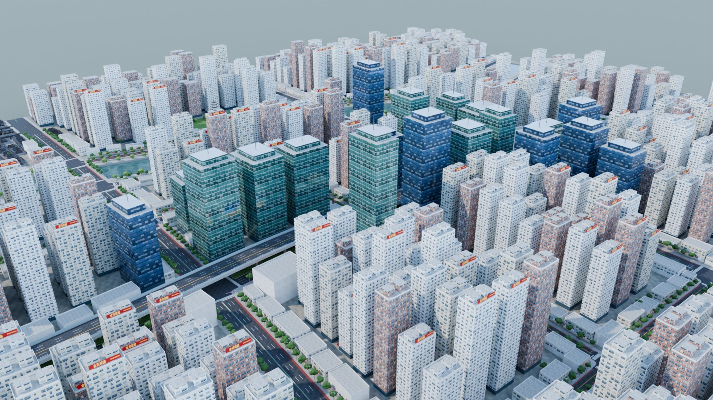
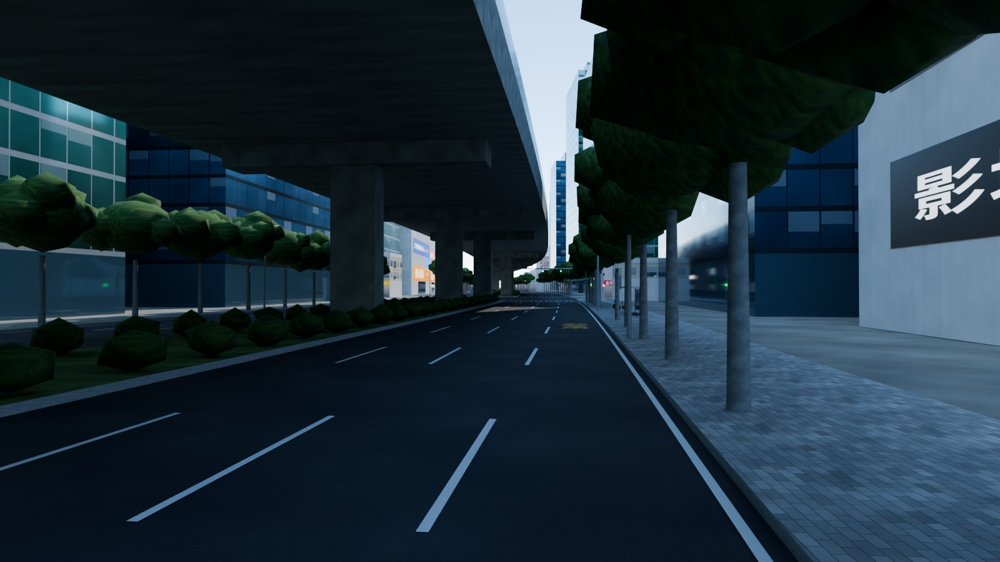
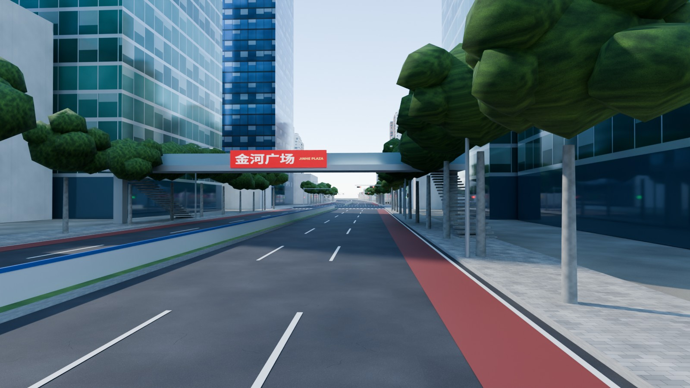
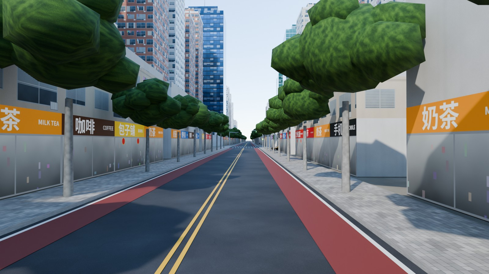
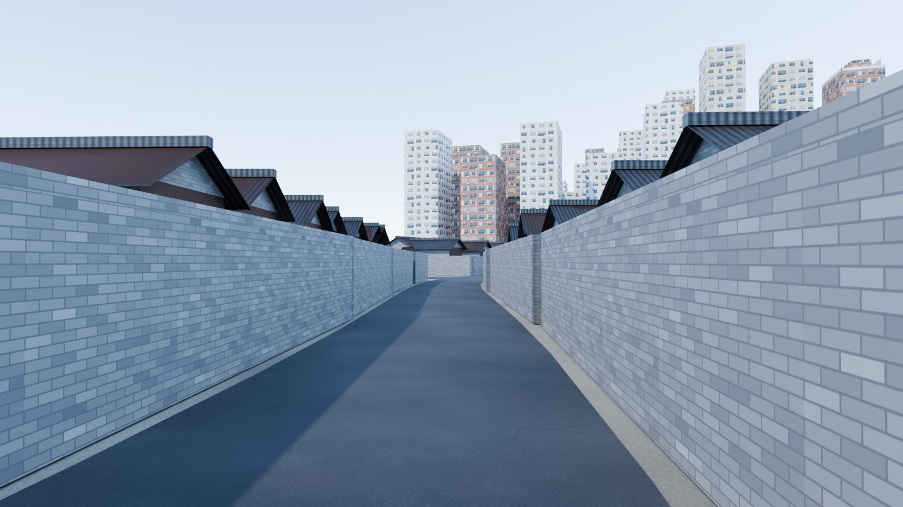
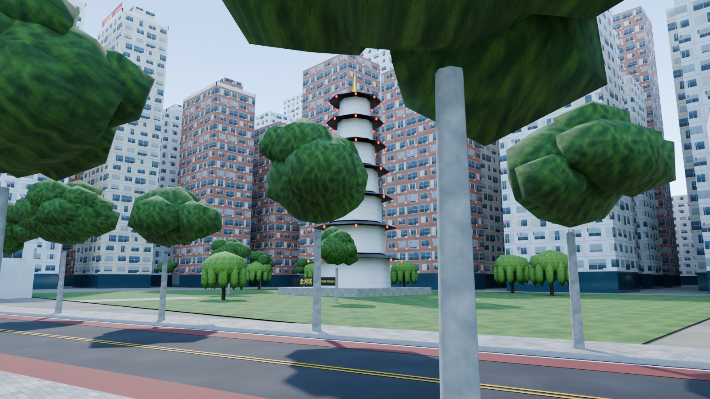
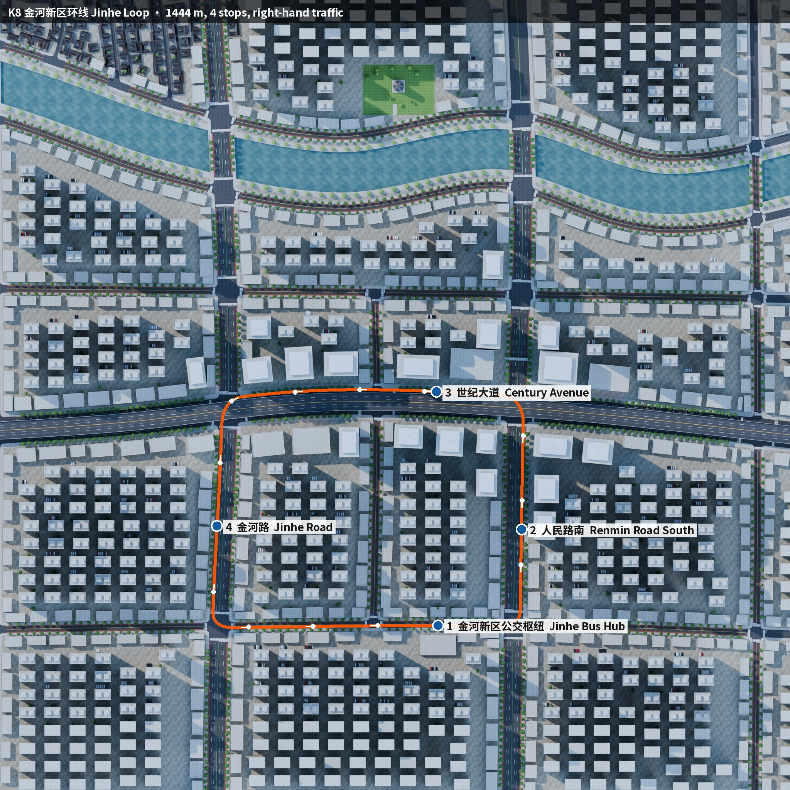

# China — Jinhe New District (金河新区)

A district modelled on the new districts of Chinese cities, for **NammaBusSim**. Traffic drives on the **right**.

<p>






</p>



## What's in the map

| Real-life pattern | In the map |
|---|---|
| Wide boulevards with elevated expressways | *世纪大道 Century Avenue*: 8 lanes with a planted central belt, curving gently. An elevated expressway runs on piers in the median, with transparent sound barriers. |
| Avenues with fenced medians and non-motorised lanes | *金河路 Jinhe Rd* and *人民路 Renmin Rd*: 6 lanes, a white and blue median fence, a red bike lane on each side, and plane trees. |
| Superblocks of high-rise compounds (小区) | 18–32-storey towers, all facing south and spaced for sunlight. Each has a lobby, AC cages, rooftop machine rooms and red compound-name signs. |
| Shop podiums along streets (底商) | 2–4-storey shop rows with signs such as 超市, 药店, 奶茶, 兰州拉面 and 火锅. Shared bikes are parked out front. |
| Commercial core | Glass office towers with spires, plus *金河广场 Jinhe Plaza* mall with LED screens. |
| River with bridges | *金河 Jin River* winds between stone embankments, with a willow promenade. 4 roads cross it on bridges with stone parapets. |
| Old town | A hutong-style quarter of grey-brick courtyard houses with curved tile roofs, red gates and lanterns. |
| Landmarks | The 7-storey *金河塔* pagoda in a riverside park, a pedestrian overpass (天桥) across Renmin Rd, and the *金河新区公交枢纽* bus hub. |
| Traffic details | Horizontal signal heads on cantilever arms with countdown boxes, zebra crossings, yellow double centre lines, 6 m/9 m dashed lane lines, and 公交专用 bus-lane text. |

**Route K8 — 金河新区环线 Jinhe Loop** is 1.44 km with 4 stops. It runs along these roads:

1. From the bus hub, east on Jianshe Rd
2. North on Renmin Rd
3. West along Century Avenue, under the expressway
4. South on Jinhe Rd
5. East on Jianshe Rd back to the hub

Doors open on the right.

## Files and rebuilding

The file layout is the same as the [India map](../india/README.md): `.blend`, `.glb`, route JSON and previews are in `out/`.

To rebuild:

```bash
python3 make_textures.py                      # downloads Noto Sans SC (17 MB, OFL) into fonts/ on first run
blender -b -P build_china.py -- --render      # needs shapely in Blender's Python, see ../india/README.md
python3 ../common/route_map.py . china_jinhe 0 20 1100 fonts/NotoSansSC.ttf
```

The roads are defined in `define_roads()`. The shared engine is `../common/nbs_city.py`.
