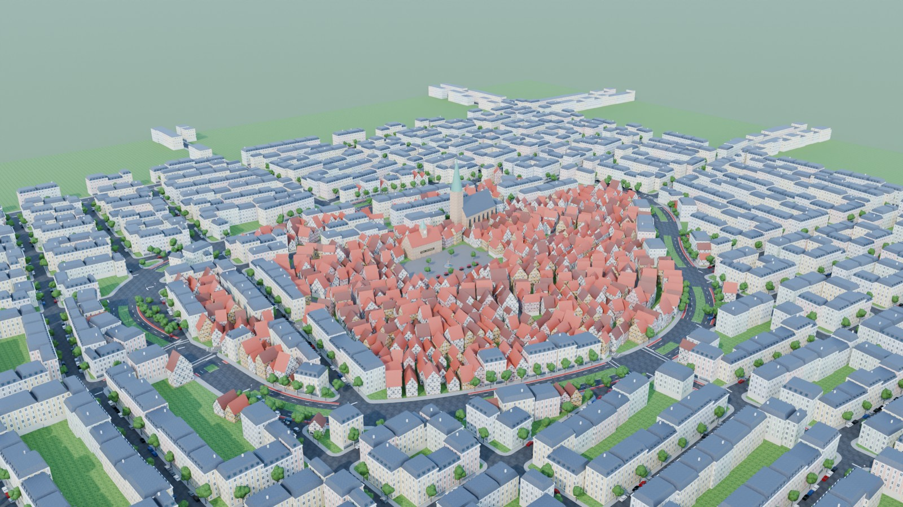
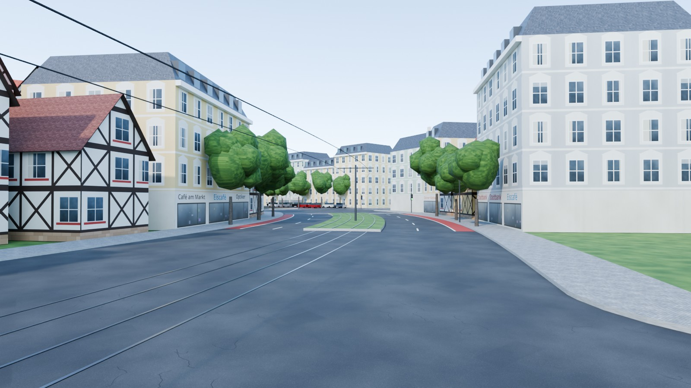
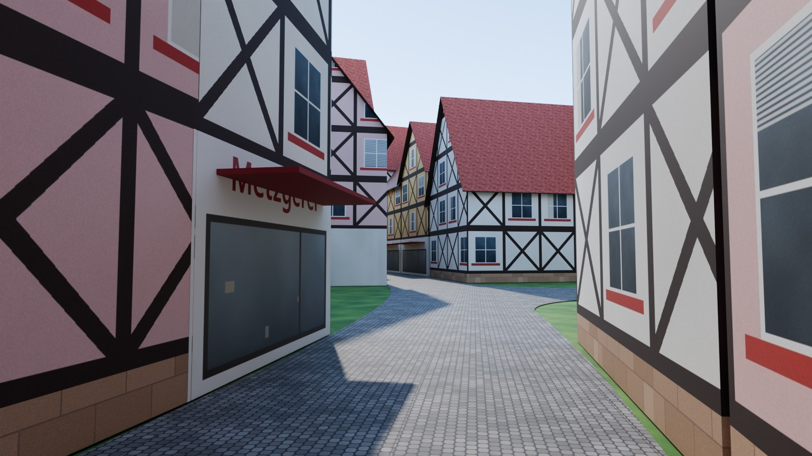
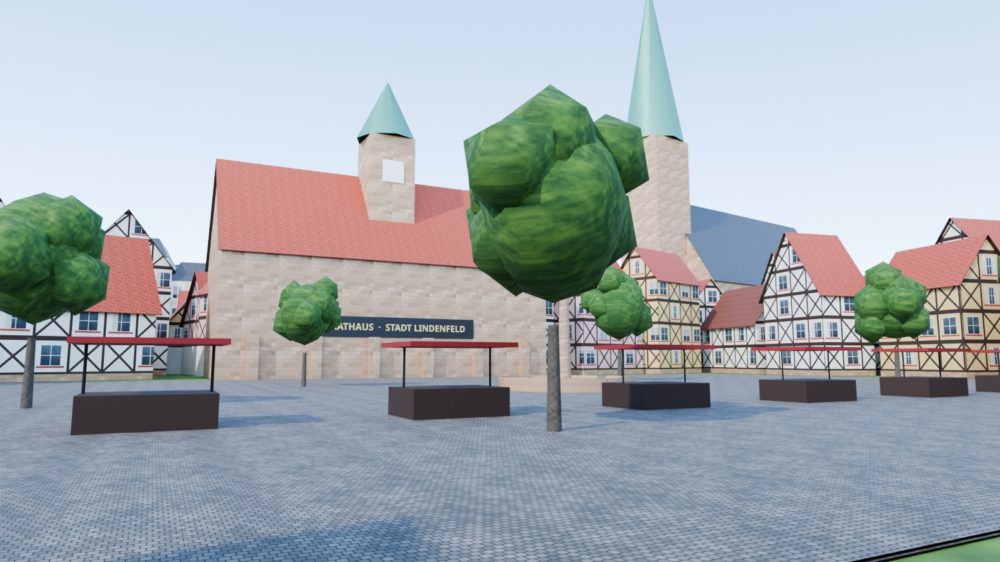
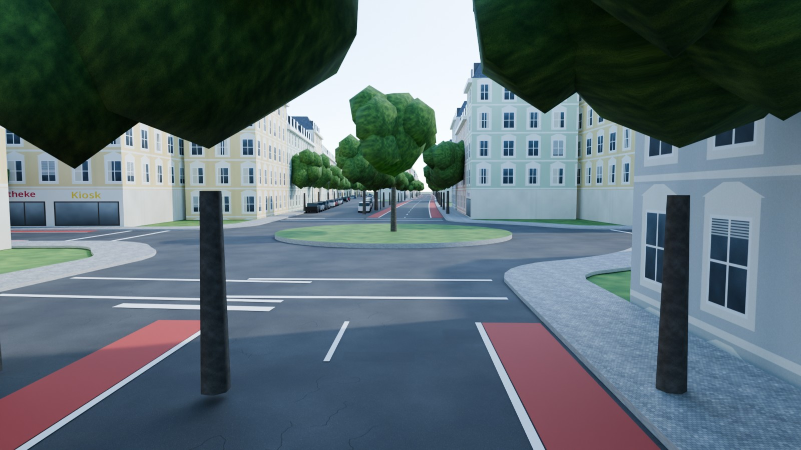
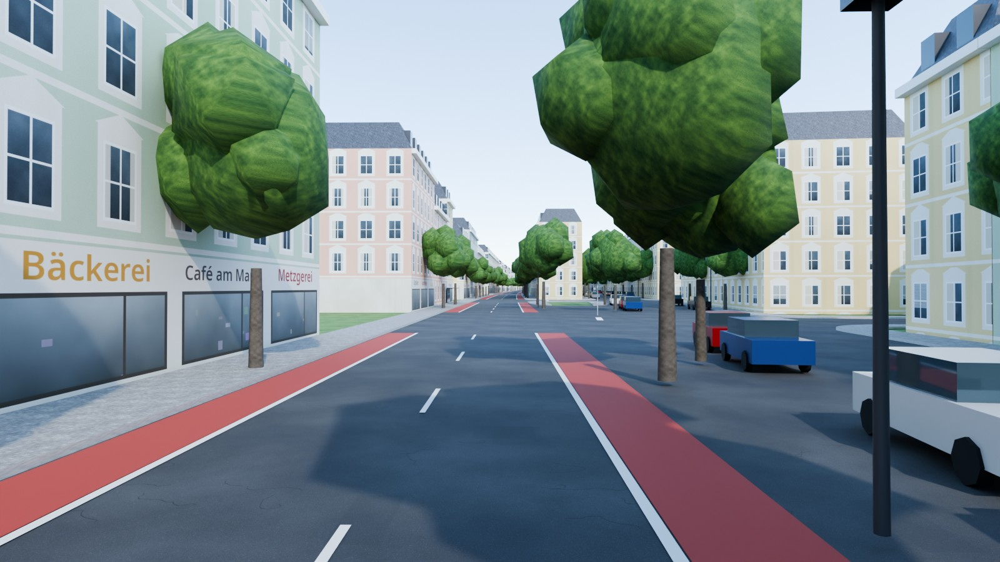
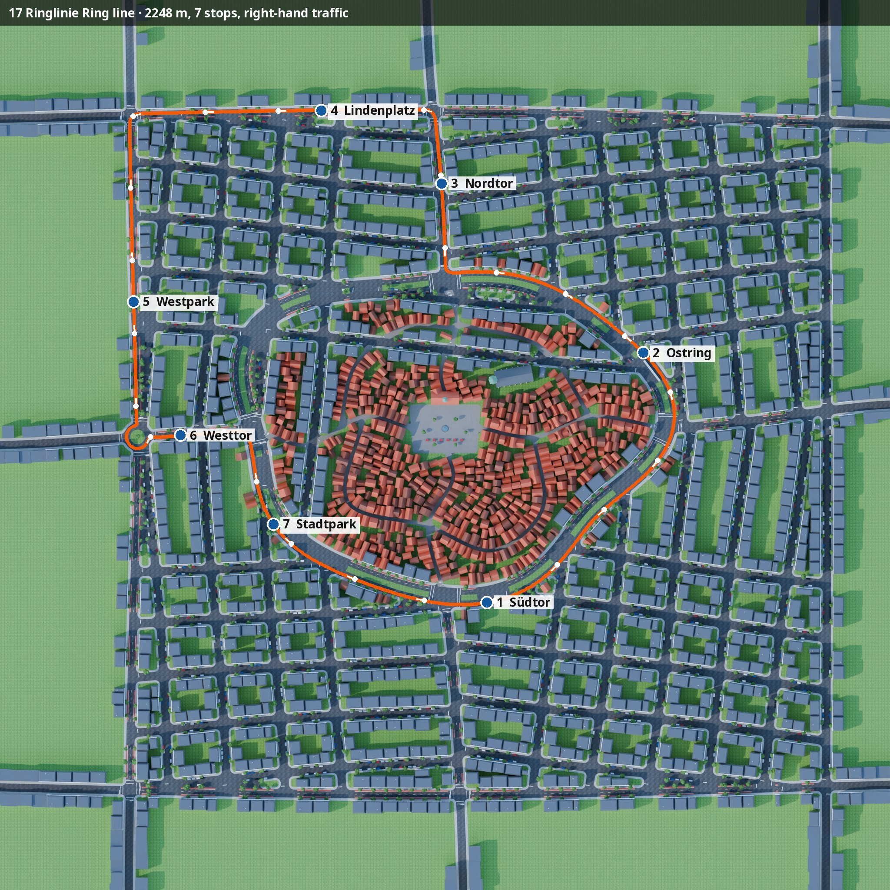

# Europe (Germany) — Lindenfeld, a German old town

A German *Altstadt* and its 19th-century surroundings, for **NammaBusSim**. Traffic drives on the **right**.

<p>






</p>



## What's in the map

| Real-life pattern | In the map |
|---|---|
| Ring road on the old town wall | The curving *Ring* has 4 lanes, linden trees, and red bike lanes painted on the road. A tram runs on a grass track in the median, with catenary masts and a tram in service. *Vorfahrtstraße* (priority road) diamond signs stand along it. |
| Altstadt | Cobbled, winding *Gassen*: Marktgasse, Kirchgasse, Webergasse, Gerbergasse and others. They're lined with 2–4-storey half-timbered (*Fachwerk*) houses with steep gable roofs, flower boxes and shops (*Bäckerei*, *Apotheke*, *Metzgerei* …). *Zone 30* signs are at the gates. |
| Marktplatz | A cobbled square with a sandstone fountain and a gilded figure. The *Rathaus* has an arcade, stepped roof and clock tower, and there are market stalls. The Gothic church nearby has a 77 m copper spire. |
| Gründerzeit city | Perimeter blocks of 4–5-storey stucco houses with window pediments, cornices, slate mansard roofs and dormers, plus shops on the main streets. The streets use German names and have parked cars. |
| Radial roads and *Kreisverkehr* | *Nordstraße*, *Bahnhofstraße*, *Ostallee* and *Westallee* leave through the gates. *Lindenallee* crosses Westallee at a roundabout, driven counter-clockwise. |
| Signage | *Haltestelle* (green H on yellow) bus stops with shelters. Yield triangles where minor roads meet bigger ones, and *Fußgängerfurt* crossings at the signals. |

**Route 17 — Ringlinie** is 2.25 km with 7 stops. It runs:

1. From *Südtor*, three-quarters of the way around the Ring
2. Out along Nordstraße
3. West on the Nordring
4. South on Lindenallee
5. Around the Kreisverkehr
6. In through the *Westtor*
7. Back along the Ring

Doors open on the right.

## Files and rebuilding

```bash
python3 make_textures.py
blender -b -P build_europe.py -- --render      # needs shapely, see ../india/README.md
python3 ../common/route_map.py . europe_lindenfeld 0 20 1100 ../common/fonts/NotoSans.ttf
```
