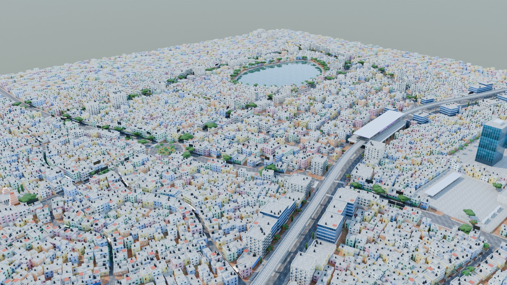
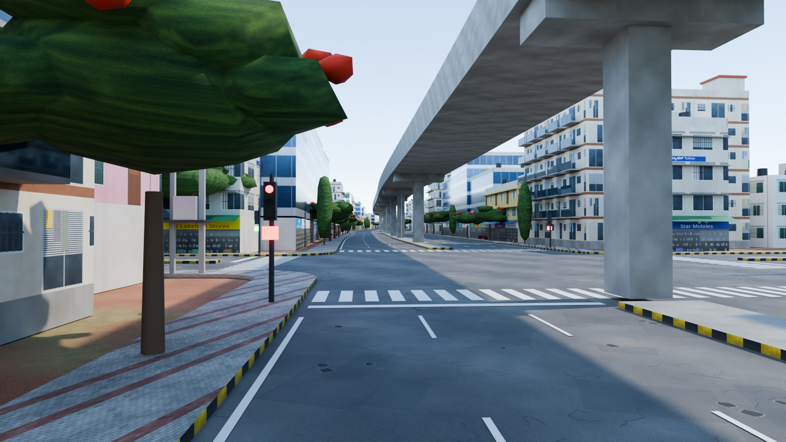
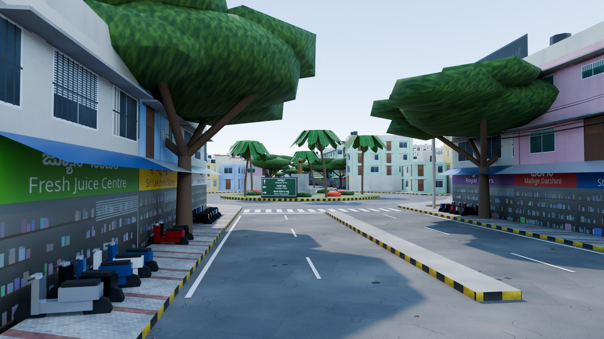
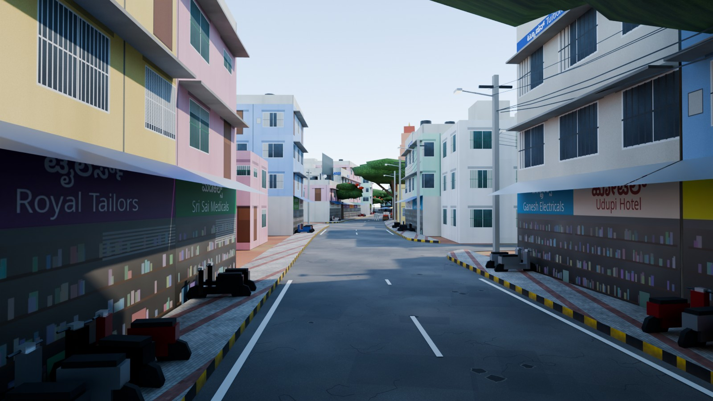
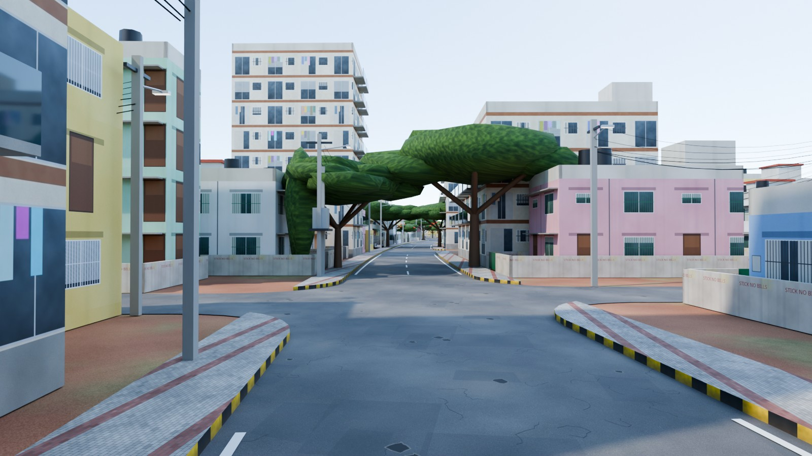
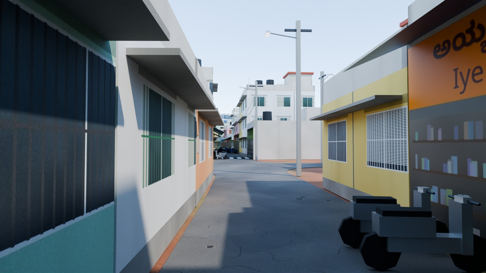
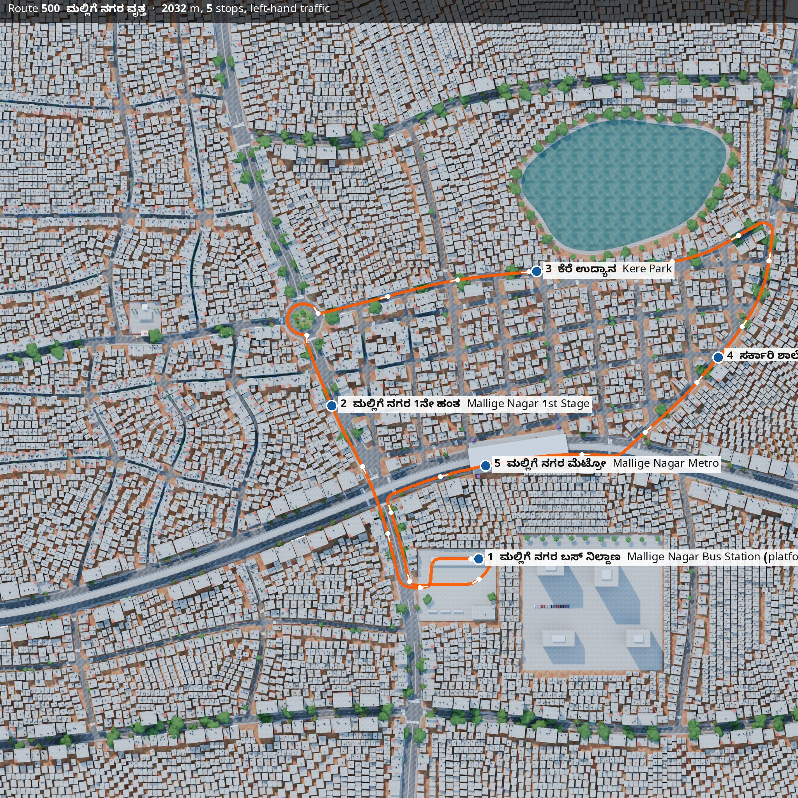

# India — Mallige Nagar (ಮಲ್ಲಿಗೆ ನಗರ), Bengaluru-style bus map

A Bengaluru-inspired district for **NammaBusSim**. Unlike the Japan grid, the roads here are **curved splines laid out after typical Bengaluru street patterns**. Junctions, rounded kerbs, medians and lane markings are all derived from those curves automatically.

<p>






</p>



## What's in the map

About 1.44 × 1.36 km in total. The drivable core is about 1.0 × 0.9 km. **Left-hand traffic.**

| Real-life pattern | In the map |
|---|---|
| Outer Ring Road with Namma Metro overhead | *ORR*: 6-lane divided road on a sweeping S-curve. An elevated metro viaduct follows its median, and *Mallige Nagar Metro* station spans the road, with a train at the platform. |
| Traffic "circles" | *ಮಲ್ಲಿಗೆ ವೃತ್ತ Mallige Circle*: a roundabout driven clockwise. It has a statue, palms, flower beds and a name board, and five roads meet at it. |
| Arterial main roads lined with rain trees | *Mallige Main Road*: 4-lane with a black-and-yellow median and a canopy of rain trees (Samanea saman). |
| Kere (lake) roads | *Kere Road* bends around *Mallige Kere*, which has a stone bund, a walking path, a railing, palms and rain trees. |
| Pete / old-town lanes | Winding 4.5 m lanes with attached 1–3 storey houses and shops, no setbacks, two-wheelers parked out front, and speed breakers. |
| BDA-style planned layout | A gently skewed "Mains & Crosses" grid with compound walls, MS gates, colourful G+1–G+3 houses, chajjas, and black water tanks on the roofs. |
| Market street | *Temple Street*: shops with **Kannada + English** boards, tin awnings and rooftop hoardings. Sri Ganesha Temple has a gopuram, flower carts and cows. |
| Street furniture | Concrete poles with bundles of sagging cables, transformers and LED street lights. Vertical signals with countdown timers sit at 6 junctions. Kerbs and medians are painted black and yellow, with zebra crossings and stop lines. |
| Other landmarks | *Mallige Nagar Bus Station* (depot, with a boarding platform and canopy), a glass tech park on the ORR, gated apartments, and autos waiting at the circle. |

**Route 500 — ಮಲ್ಲಿಗೆ ನಗರ ವೃತ್ತ loop** is 2.03 km with 5 stops. It starts at platform 1 of the bus station and runs along these roads:

1. Main Road
2. ¾ of the way around Mallige Circle
3. Kere Road, round the lake
4. East Road
5. The ORR, under the metro
6. Main Road back to the depot

Every stop has a steel shelter showing *ಬಸ್ ನಿಲ್ದಾಣ / BUS STOP* and "BUS STOP" painted in the kerb lane. Doors open on the left.

## Files

| File | What it is |
|---|---|
| `out/india_mallige_nagar.blend` | Open this in Blender 5.x (it was built with 5.2 LTS). Textures are packed, and the cameras and sun/sky are set up. *BusRoute (helper)* shows the route. A reference 12 m bus is included. |
| `out/india_mallige_nagar.glb` | Game-ready export: Y-up, metres, embedded textures, meshes chunked into 200 m tiles. About 585 k faces. |
| `out/india_mallige_nagar_route.json` | Contains: <ul><li>the spawn point</li><li>the route polyline</li><li>stops in Kannada and English</li><li>the roundabout (centre, radii, direction)</li><li>signalised junctions and speed-breaker positions</li><li>every road's centreline, lanes, widths and speed limit</li></ul> Every point is given in both Blender and glTF coordinates. |
| `out/previews/` | Renders, including `topdown.jpg`: a 1000 m square centred on x=50, y=20, usable as a minimap. |
| `build_india.py` | The generator. Edit the `ROADS` control points to reshape any street. |
| `make_textures.py` | Generates the textures. Kannada is drawn with Noto Sans Kannada (OFL, in `fonts/`). |
| `../common/nbs_kit.py` | Shared toolkit: mesh batching, curved-road helpers, export. |

## Rebuild

`build_india.py` needs **shapely** inside Blender's Python.

Option 1: install shapely into Blender's bundled Python (macOS):

```bash
/Applications/Blender.app/Contents/Resources/5.2/python/bin/python3.13 -m pip install shapely pillow
cd bus-sim-maps/india
/Applications/Blender.app/Contents/MacOS/Blender -b -P build_india.py -- --render --samples 40
python3 make_route_map.py
```

Option 2: use Blender as a Python module. This is what produced the committed files:

```bash
python3.13 -m venv bvenv && bvenv/bin/pip install bpy shapely pillow numpy
bvenv/bin/python build_india.py -- --render
```

Options for `build_india.py`:

| Option | What it does |
|---|---|
| `--out DIR` | Write the outputs to `DIR` instead of `out/`. |
| `--seed N` | Generate different buildings on the same streets. |
| `--no-glb` | Skip the glTF export. |
| `--render` | Render the preview images. |
| `--only Circle` | With `--render`, render a single camera. |

## Making it match a real place

To trace a real Bengaluru neighbourhood:
1. Export the area from openstreetmap.org (*Export* → `.osm`).
2. Replace the `ROADS` control points with the way coordinates, projected to metres around a centre point.

Everything downstream adapts automatically: junctions, kerbs, markings, buildings and the route.
