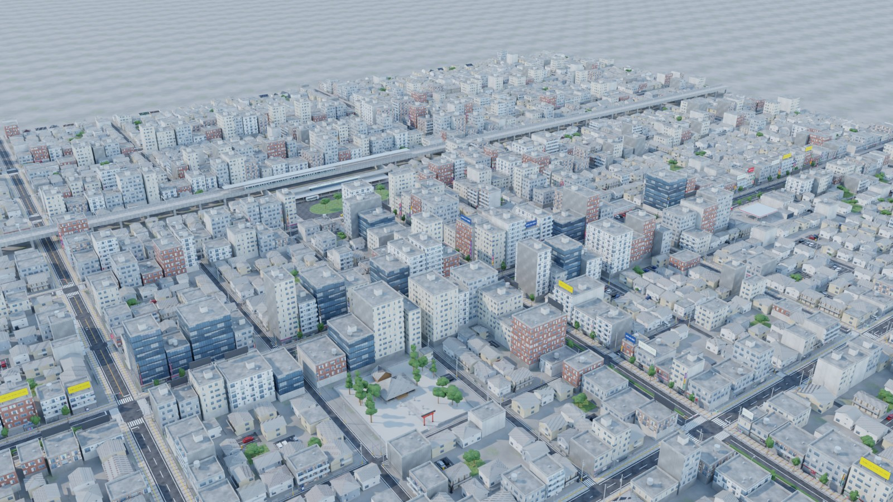
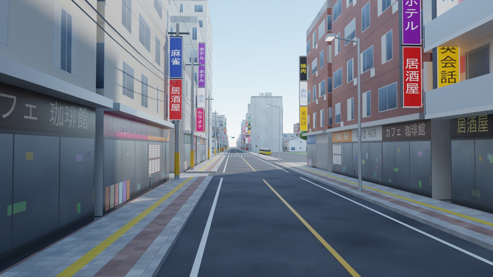
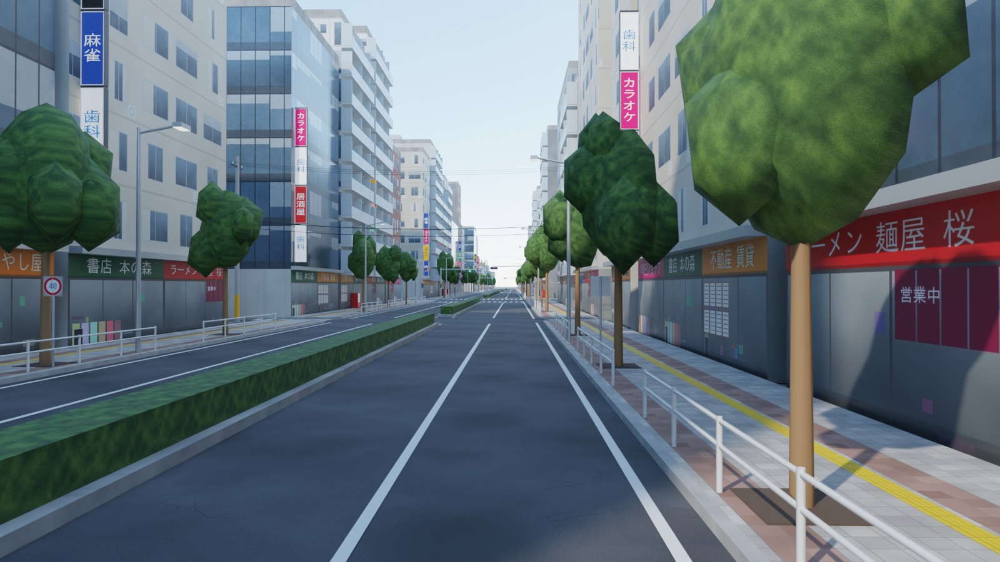
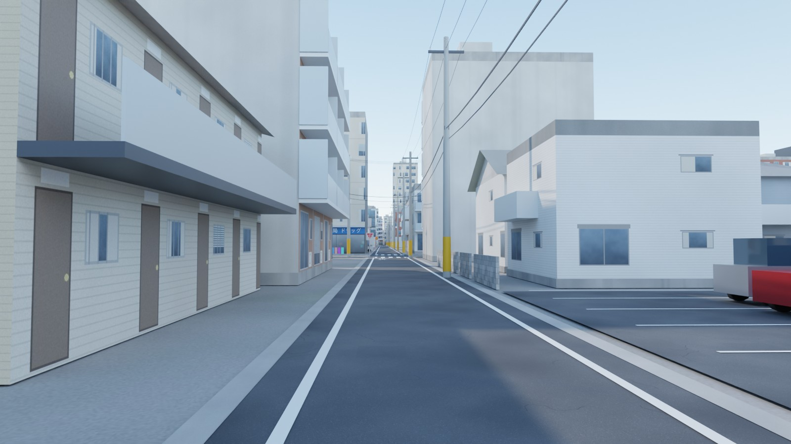
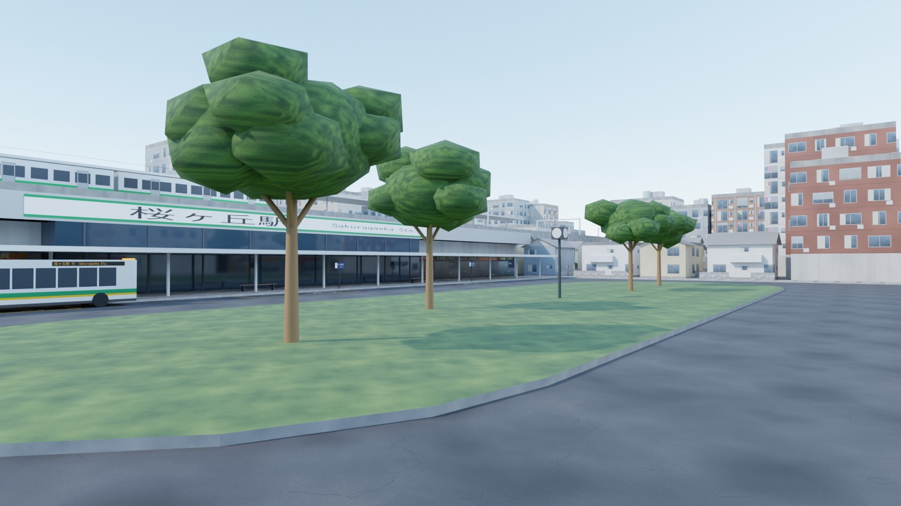
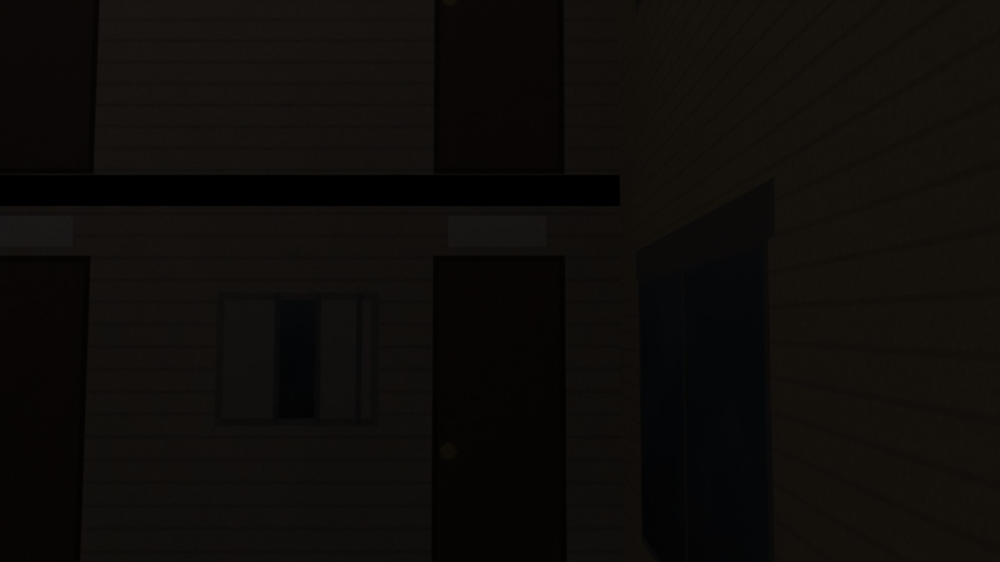
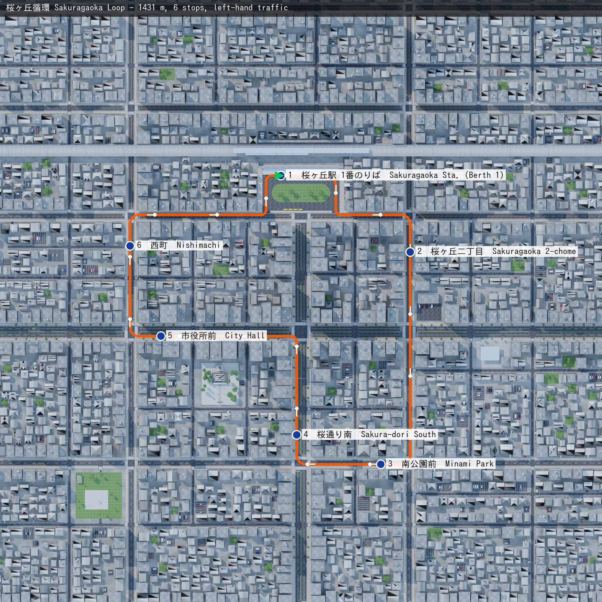

# Japan — Sakuragaoka (桜ヶ丘), Tokyo-style bus map

A Japanese city district for **NammaBusSim**, built in Blender by a script so it can be rebuilt, tweaked, and later re-skinned for other countries.

<p>






</p>



## What's in the map

About 1.1 × 1.0 km in total. The drivable core is 760 × 680 m, and a lower-detail ring of streets and buildings around it fills the horizon.

- **Left-hand traffic** with Japanese road markings:
  - white edge lines and dashed lane lines
  - yellow no-overtaking centre lines near the station
  - zebra crossings painted parallel to traffic
  - stop lines, plus 止まれ and バス painted on the road
- **Road types**:
  - *Sakura-dori* (桜通り) and *Ekimae-odori* (駅前大通り): 4-lane arterials with a planted median, ginkgo trees and white guard pipes
  - 2-lane streets with 3 m sidewalks and yellow tactile paving (点字ブロック)
  - narrow 5 m residential lanes with concrete gutters
- **Sakuragaoka Station**:
  - elevated railway with a train at the platform
  - bus rotary (駅前ロータリー), driven clockwise, with 3 numbered berths (のりば), a canopy and a taxi rank
- **Street furniture**:
  - concrete utility poles with power and telecom wires, plus transformers
  - Japanese horizontal 3-lamp traffic signals at 11 junctions, with pedestrian heads
  - streetlights, curve mirrors at blind lane corners
  - inverted-triangle 止まれ signs, 40 km/h signs and a blue overhead direction sign
- **Buildings**:
  - near the station: shops with Japanese signage, vertical 看板 signs and rooftop billboards
  - balconied mansions (マンション), wooden アパート with outside stairs
  - houses with kawara or metal roofs, block walls and cars in the drive
- **Landmarks**: 桜ヶ丘神社 shrine with a torii and cedars, a park with swings and a slide, a konbini with parking, a gas station, and coin parking lots.
- **Bus route**: *桜ヶ丘循環 Sakuragaoka Loop*, 1.43 km with 6 stops. It starts at station berth 1, and every stop is on the left curb so the doors open on the correct side.

## Files

| File | What it is |
|---|---|
| `out/japan_sakuragaoka.blend` | Open this in Blender 5.x (it was built with 5.2 LTS). Textures are packed. Cameras, sun and sky are set up. The bus route is a helper curve. A reference 10.5 m bus is included for scale. |
| `out/japan_sakuragaoka.glb` | Game-ready export: Y-up, metres, embedded textures, meshes chunked into 200 m tiles. Excludes the cameras, the helper route and the reference bus. |
| `out/japan_sakuragaoka_route.json` | Bus route polyline, stops, spawn point, road list (lanes, widths) and signalised junctions. Every point is given in both Blender and glTF coordinates. |
| `out/previews/` | Rendered previews, including a top-down render you can use as a minimap (`topdown.jpg`, 780 m square, centred on x=0, y=40). |
| `build_city.py` | The generator. Change the road table, building mix or `--seed` and rebuild. |
| `make_textures.py` | Generates every texture, including Japanese signage drawn with a CJK font. |
| `make_route_map.py` | Draws the route and stops over the top-down render. |

## Open / rebuild in Blender

To open the map, double-click `out/japan_sakuragaoka.blend`. Pick a camera under the *Cameras* collection and press Numpad 0.

To rebuild it (macOS):

```bash
cd bus-sim-maps/japan
python3 make_textures.py            # only if you change textures (needs: pip install pillow numpy)
/Applications/Blender.app/Contents/MacOS/Blender -b -P build_city.py -- --render --samples 48
python3 make_route_map.py
```

Options for `build_city.py`:

| Option | What it does |
|---|---|
| `--out DIR` | Write the outputs to `DIR` instead of `out/`. |
| `--seed N` | Generate a different random city on the same street plan. |
| `--no-glb` | Skip the glTF export. |
| `--render` | Render the preview images. |
| `--only Arterial` | With `--render`, render a single camera. |

You can also open `build_city.py` in Blender's *Scripting* tab and press **Run Script**. It needs the `textures/` folder next to it.

## Using it in the game

- **Coordinates**:
  - Blender: +X east, +Y north, +Z up.
  - glTF / Unity / Godot / three.js: +X east, +Y up, −Z north. Convert with `gltf = [x, z, -y]`. The JSON already includes the `*_gltf` versions.
- **Collision**: every mesh carries a glTF `extras.nbs_collision` flag. It is true for roads, sidewalks, buildings, the station, the railway and the terrain. `extras.nbs_surface` is `asphalt`, `curb` or `ground`, so tyres and audio can react to the surface.
- **Kerbs**: sidewalks are 15 cm higher than the road.
- **Spawn**: berth 1 at the station, facing east, with the bus's left-side doors to the platform.
- **AI traffic**: `roads[]` lists every street with its lanes per direction, lane width and median. Junction centres are where the E-W and N-S centre lines cross.
- **Speed limits**: 40 km/h on the arterials, 30 km/h elsewhere.
