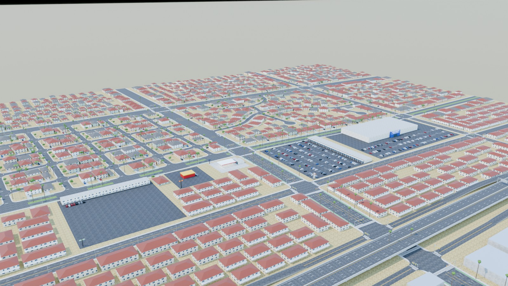
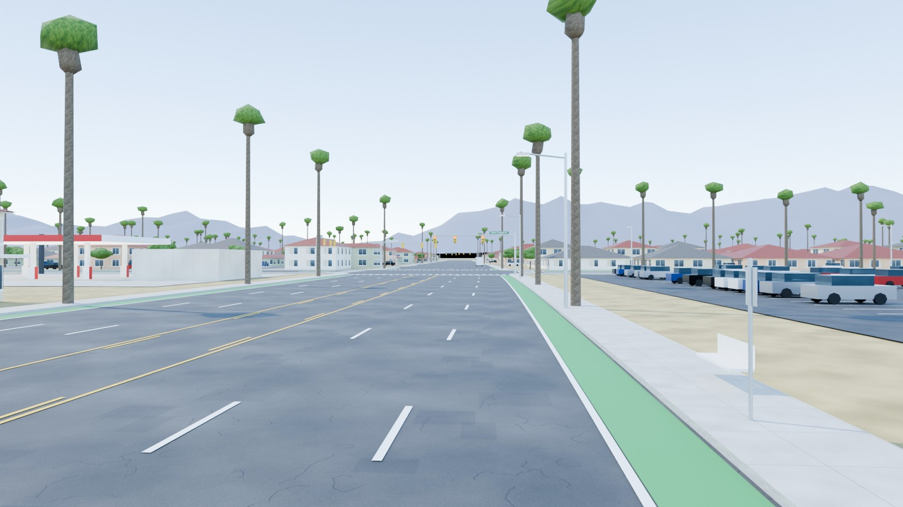
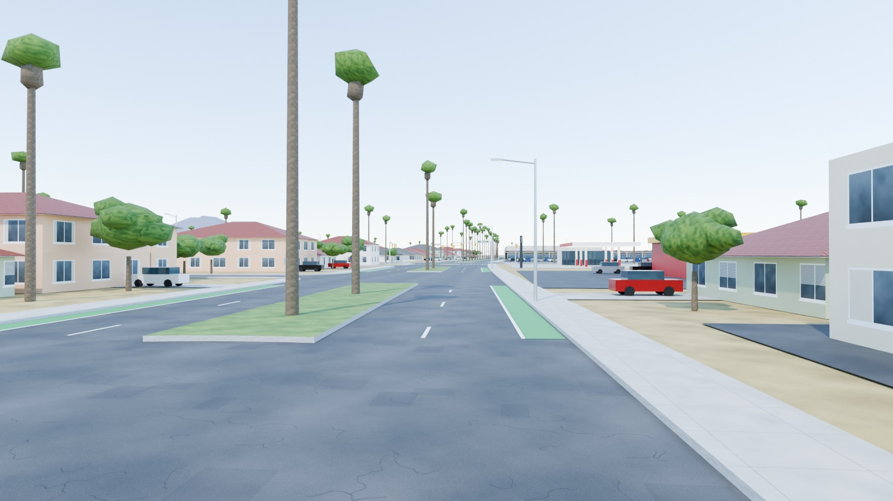
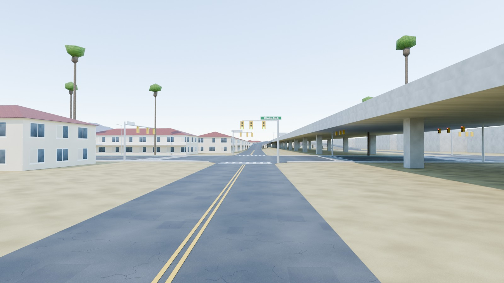
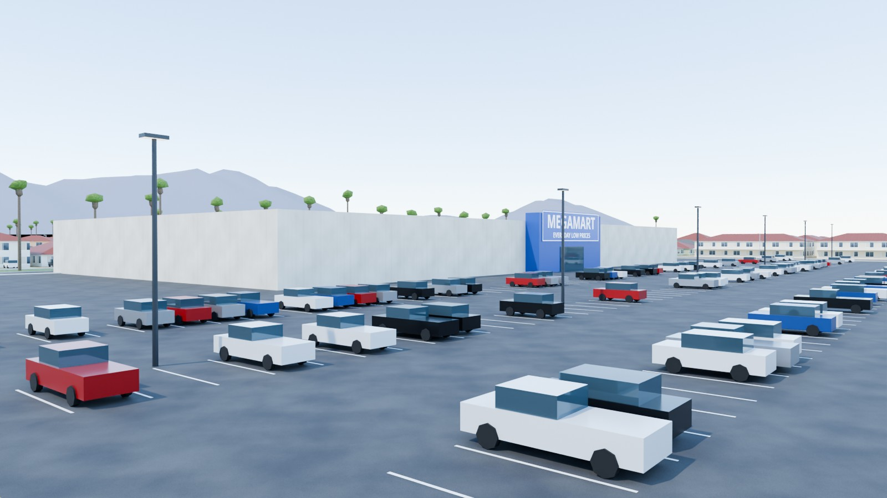
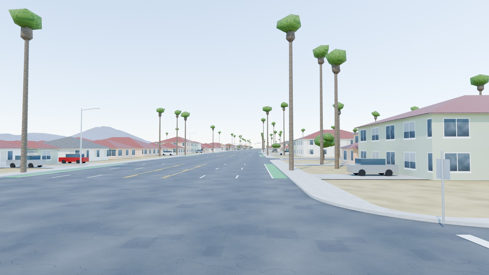
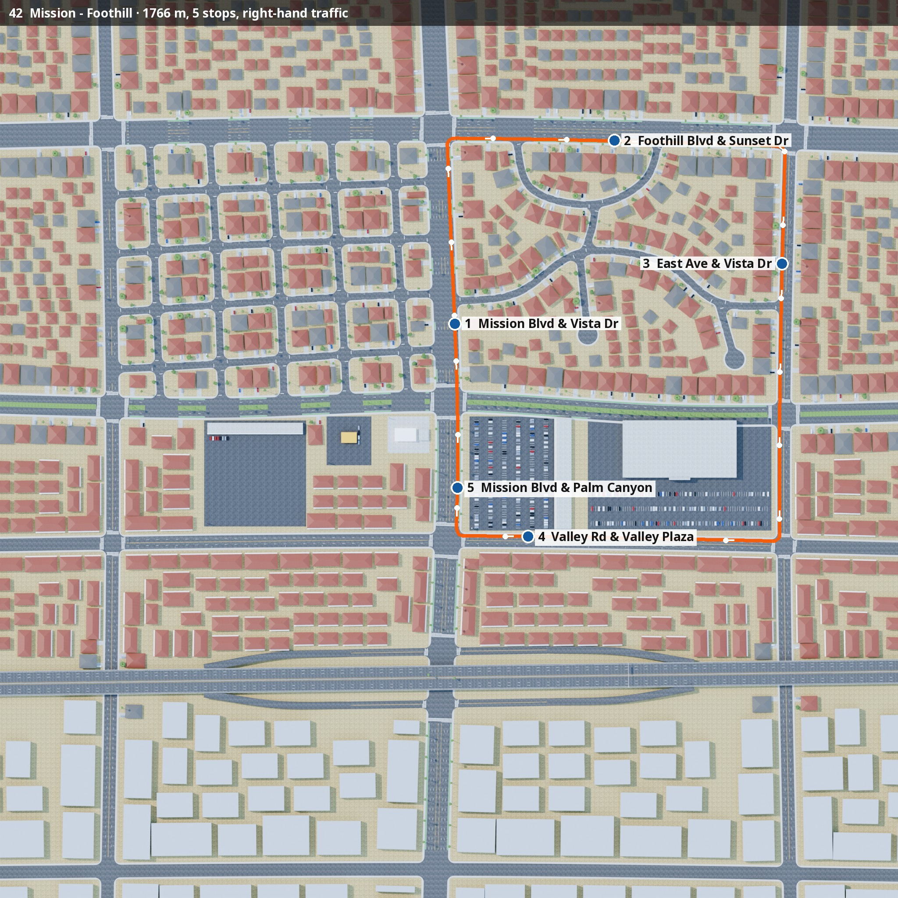

# USA — Palm Valley, California (SoCal-inspired)

A Southern-California suburb for **NammaBusSim**. Traffic drives on the **right**.

<p>






</p>



## What's in the map

| Real-life pattern | In the map |
|---|---|
| The "stroad" | *Mission Blvd* and *Foothill Blvd*: 6 lanes with a yellow two-way left-turn lane in the middle, green bike lanes, and Washingtonia palms on the sidewalks. |
| Palm-lined boulevard | *Palm Canyon Dr*: a raised grass median with a row of tall fan palms. |
| Freeway | *Valley Freeway* is elevated on piers. A diamond interchange with 4 curved ramps meets signalised ramp terminals on Mission Blvd, and there's an overhead green guide sign: *EXIT 12 Mission Blvd*. |
| Car-oriented commercial | *Valley Plaza* strip mall, a *Megamart* big-box store with a huge striped lot and light poles, a gas station, a *Burger Barn* drive-thru with its queue, and the *Palm Motel*. |
| Housing | Garden apartments, tilt-up warehouses south of the freeway, and suburbs of 1–2-storey stucco houses. The houses have clay-tile or shingle hip roofs, 2-car garages, driveways and front-yard palms. |
| Street layout | Curvy streets (*Vista Dr*, *Sunset Dr*), cul-de-sacs with bulbs (*Canyon Ct*, *Mesa Ct*), and a 1950s tract grid. |
| Traffic control | Yellow signal heads on mast arms with overhead street-name signs. STOP signs on the side streets, and ladder crosswalks. |
| Backdrop | Hazy mountains about 12 km to the north. |

**Route 42 — Mission–Foothill** is 1.77 km with 5 stops. It runs:

1. North on Mission Blvd
2. East on Foothill Blvd
3. South on East Ave
4. West on Valley Rd
5. North on Mission Blvd, back to the start

All of its turns are right turns. Doors open on the right. The route JSON records `speed_units: mph`.

## Files and rebuilding

```bash
python3 make_textures.py
blender -b -P build_usa.py -- --render      # needs shapely, see ../india/README.md
python3 ../common/route_map.py . usa_palm_valley 0 0 1100 ../common/fonts/NotoSans.ttf
```
