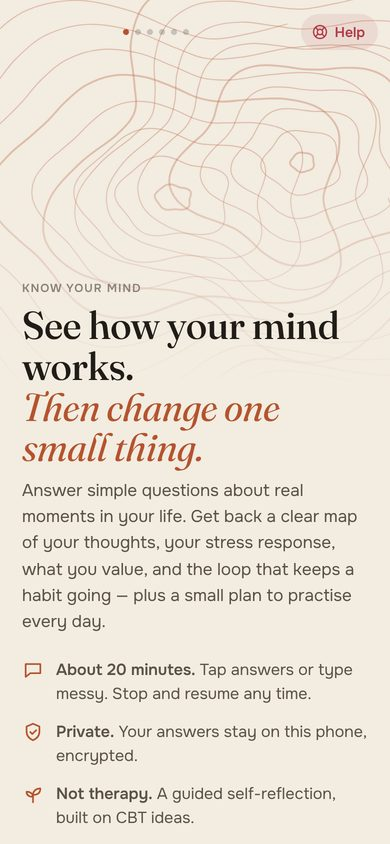
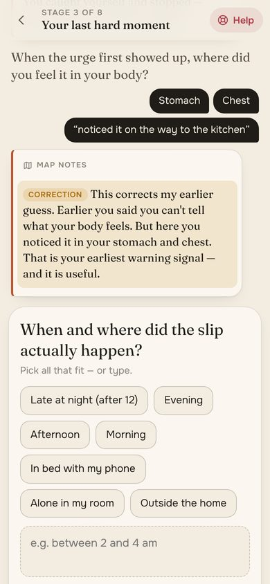
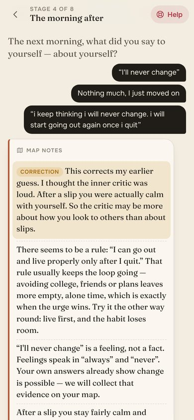
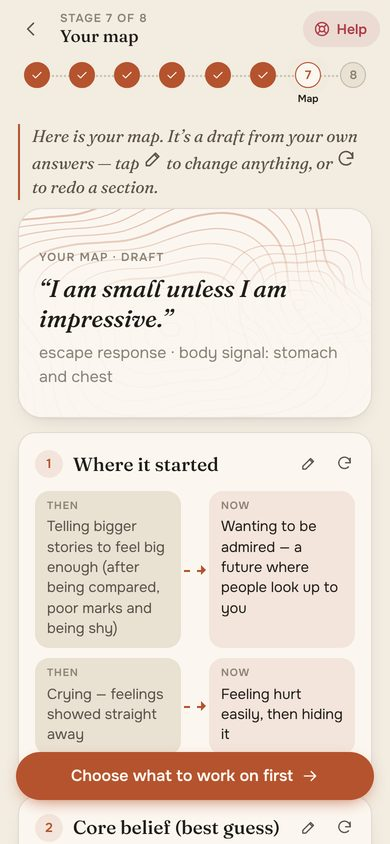
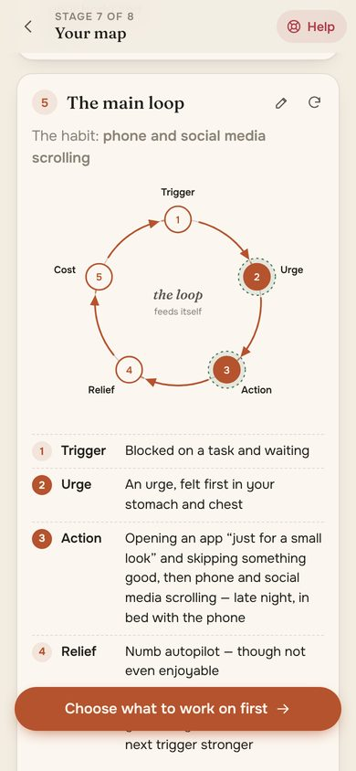
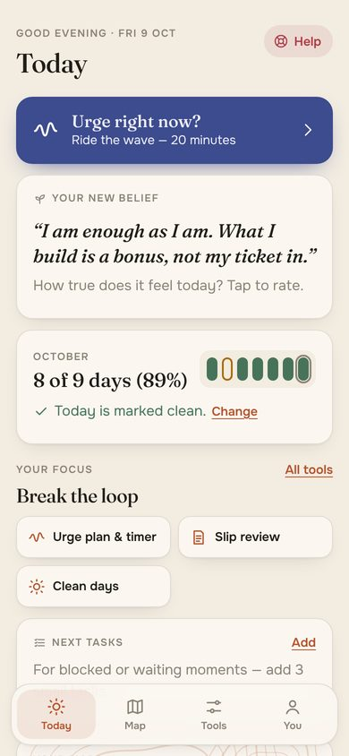
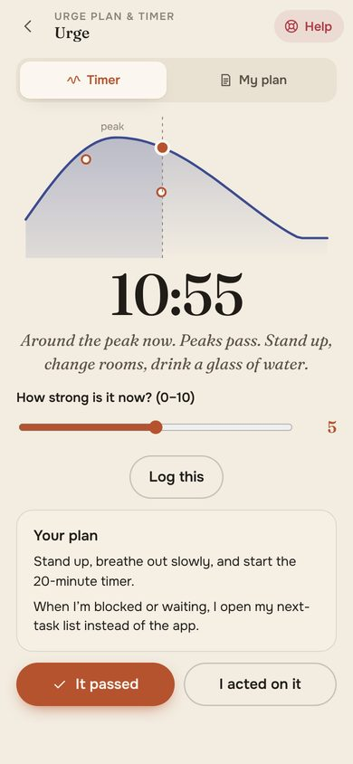
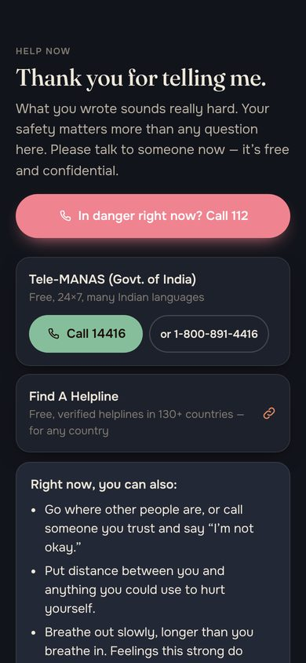

# Know Your Mind

**Answer simple questions about real moments. Get a clear map of how your mind works — and one small thing to practise every day.**

Working title from the [handoff](docs/HANDOFF.md). Private, on your phone. Not therapy.

<p>




</p>
<p>




</p>

---

## What it does

1. **An interview that feels like a conversation.** 18 short questions in 6 stages, one at a time, about *real situations* — never abstract ("Someone disagrees and everyone nods. What do you do?"). Tap answers or type messy; typos and Hinglish are fine. Stop and resume any time.
2. **After every answer, the guide reflects back** what it notices — as guesses. When a later answer contradicts an earlier guess, it **corrects itself out loud** ("This corrects my earlier guess…").
3. **It doesn't agree with false beliefs to be nice.** "This habit makes my face ugly" gets a kind, honest answer with reasons. No false health claims, ever.
4. **The map** — seven sections, editable, each can be redone:
   1. Where it started (then → now)
   2. Core belief (best guess) and the life rule it creates
   3. How your mind works — thinking habits, stress response (fight / escape / freeze / shutdown), earliest body signal, weakest times
   4. What matters to you — what you'd still do with nobody watching vs. what depends on approval
   5. The main loop — trigger → urge → action → relief → cost, as a diagram
   6. Strengths — each with evidence from your own words
   7. What to change — 3 to 5 concrete actions
5. **Daily tools** — urge plan + a 20–30 minute "ride the wave" timer, 2-minute slip review, clean days per month (*12 of 13 days (92%)*, never a streak that resets), thought record, attention-outward practice with one small disagreement a day, new-belief practice, next-task list, night mode.
6. **Help is one tap away on every screen.** Crisis lines for India, the US, the UK and Ireland, plus a worldwide directory. A message about suicide, self-harm or harming someone pauses the interview and shows help **in the same turn** — checked on the phone, before anything is sent anywhere.

## Why it's different

| Most apps | Know Your Mind |
|---|---|
| Ask abstract questions ("How do you handle conflict?") | Asks about one real moment at a time |
| Give a score or a label | Gives *guesses* you can edit — and admits when it was wrong |
| Agree with you to keep you happy | Questions false beliefs kindly, with reasons |
| Streaks that reset to zero after a slip | "12 of 13 days (92%)" and a 2-minute slip review — learning, not punishment |
| Need an account and the cloud | Works fully offline. Encrypted on your phone. No account, no ads, no analytics |
| Generic praise | Strengths only with evidence from your own answers |

Two guides, same rules: the **on-phone guide** (free, private, offline — built from the handoff's method) and the optional **AI guide** (Claude, through your own small server) for richer reflections. If the AI is off, offline or fails, the on-phone guide takes over silently.

## Try it

**Android:** download [`release/KnowYourMind-0.1.0.apk`](../release/KnowYourMind-0.1.0.apk), open it, allow "install unknown apps". Android 7.0+.
This first build is signed with a test key. Before real users install it, make your own release key (see *Build the APK* below) — Android only updates an app signed with the same key, and uninstalling deletes the data on the phone.

**Web (any computer):**

```bash
npm run start:mind        # http://localhost:8090
```

## Turn on the AI guide (optional)

The app never holds an API key. The key lives only on the server (handoff §10).

```bash
cd mind/server
npm install
ANTHROPIC_API_KEY=sk-ant-...  node server.mjs
```

| Setting | Default | What it does |
|---|---|---|
| `ANTHROPIC_API_KEY` | — | Turns the AI guide on |
| `MIND_MODEL` | `claude-opus-5-5` | Claude model used for reflections and the map |
| `MIND_EFFORT_TURN` / `MIND_EFFORT_MAP` | `low` / `medium` | Thinking effort per reflection / for the full map |
| `ALLOWED_ORIGINS` | the Android app + localhost | Who may call the API (CORS) |
| `CLIENT_TOKEN` | — | Optional shared header token |
| `PORT` | `8090` | |

Then set `apiBase` in [`js/config.js`](js/config.js) to your server's https URL and rebuild the APK. Users choose "AI guide" or "Private mode" during onboarding and can switch any time.

The server is **stateless**: it stores nothing, logs only method/path/status/time (never answers), checks every answer for crisis words *before* calling the model, asks Claude for strict JSON, then runs the same safety filters as the phone (one question at most, no false health claims). If Claude declines, Anthropic's server-side fallback re-runs the request (`fallbacks: "default"`).

## Develop

```bash
npm run test:mind         # 33 tests: safety, the sample user's map, flow, encryption, server
npm run start:mind        # web version on http://localhost:8090
npm run build:mind-apk    # release/KnowYourMind-<version>.apk
```

No build step, no framework: plain ES modules. The APK build needs `android-sdk-platform-23 aapt zipalign apksigner dalvik-exchange` (Ubuntu/Debian) or an Android SDK. The first build creates `mind/android/mind-release.keystore` (git-ignored) — **keep it safe**. For CI, add repository secrets `MIND_KEYSTORE_BASE64` and `MIND_KEYSTORE_PASSWORD`; [`.github/workflows/mind.yml`](../.github/workflows/mind.yml) runs the tests and builds a signed APK on every push to `mind/`.

```
mind/
  index.html, css/, assets/        the app (fonts and icons are bundled — no network needed)
  js/engine/content.js             the interview script: stages, questions, options  ← edit wording here
  js/engine/signals.js             what each answer means ("signals") + free-text patterns
  js/engine/analyse.js             reflections, corrections out loud, patterns
  js/engine/beliefs.js             unhelpful beliefs and the kind, evidence-based replies
  js/engine/mapbuild.js            the seven-section map, core belief, actions, focus options
  js/engine/safety.js              crisis + age detection, one-question rule, health-claim filter
  js/engine/tracking.js            clean days, slip patterns, urge/fear/belief stats
  js/engine/crisis-lines.js        verified help lines (re-check before launch!)
  js/vault.js                      AES-GCM encryption at rest, PIN lock, delete everything
  js/views/*                       screens
  server/                          optional AI proxy (Claude) + static web server
  android/                         native shell: FLAG_SECURE, no backups, tel:/sms: links
  tests/                           node:test suites + the handoff's sample user as a fixture
  docs/                            handoff, architecture, safety, contributing
```

More: [architecture](docs/ARCHITECTURE.md) · [safety & launch checklist](docs/SAFETY.md) · [how to help](docs/CONTRIBUTING.md)

## Handoff checklist (MVP, §6 and §12)

| Requirement | Where |
|---|---|
| Onboarding: 18+ age gate, "not therapy" notice, consent | `views/onboarding.js` |
| Interview stages 1–8, save and resume | `engine/interview.js`, `views/interview.js` |
| Every guide message has at most one question | `safety.enforceOneQuestion`, `aishape.cleanTurn`, tests |
| Map: all seven sections + "not a diagnosis" line; view, edit, regenerate a section | `engine/mapbuild.js`, `views/mapview.js` |
| Slip review, clean-days counter, thought record | `views/tools.js`, `engine/tracking.js` |
| Crisis screen reachable from every screen; self-harm statement → crisis screen within one turn | `views/crisis.js`, `safety.crisisCheck`, tests |
| Delete everything (local; server stores nothing) | `vault.wipe`, `store.wipeAll` |
| No interview text in logs or analytics | server logs only method/path/status; no analytics SDKs; test |
| Encrypted at rest, app lock, export my data | `vault.js`, `views/you.js` |
| API key never in the app | `server/guide.mjs` only |
| Test profile (§13 patterns, fictional details) → expected map highlights | `tests/engine.test.mjs` |

Also built from the "later" list: urge timer (visual wave, no audio yet), print / save map as PDF, regenerate one section.

## Decisions still open (handoff §11)

1. **Platforms** — built for Android + web (same code). iOS would need a small native shell like `android/`.
2. **Pricing** — the on-phone guide costs nothing to run; the AI guide costs money per user. Free + paid AI plan is the natural split.
3. **Languages** — English now. All wording lives in `content.js`, `signals.js` and `beliefs.js`, ready for Hindi and other Indian languages. Crisis detection already understands common Hindi/Hinglish phrases.
4. **Data** — on the phone only. Sync would need accounts; nothing here assumes it.
5. **Name and branding** — "Know Your Mind" is the working title; change `config.appName`, `android/res/values/strings.xml` and the manifest.
6. **Licence** — decide before others contribute (the repo's root `LICENSE` covers KAYA).

---

*This app is a guided self-reflection tool. It is not therapy, diagnosis or medical advice. If you are in danger, call your local emergency number.*
